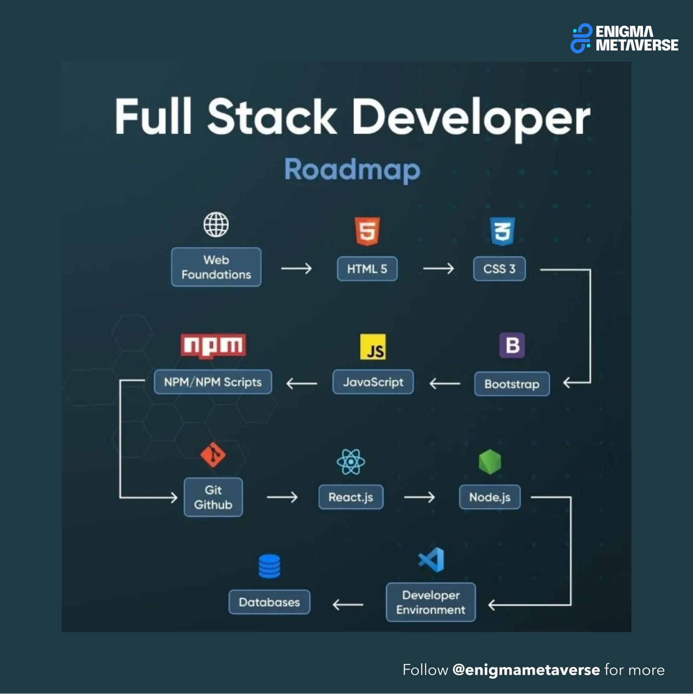
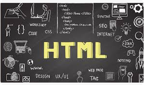
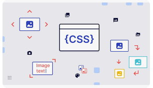

# Full Stack Development Course  
  

# Frontend Topics 

 
<h2> HTML (Hypertext Markup Language) </h2>
  
 here is the folder for more information about this. 
 <a href="./html/README.md">All topics covered on HTML</a> 

<h2>CSS (Cascading Style Sheets) </h2>
 
- 
     here is the folder for more information about this. 
 <a href="./css/README.md">All topics covered on CSS</a> 
  
- JavaScript 
- React 
- Angular 
- Vue.js 
<h1>Frontend Frameworks and Libraries </h1>
 
- Responsive Web Design 
- User Interface (UI) Design 
- User Experience (UX) Design 
- Web Accessibility 
- Web Performance Optimization 

# Backend Topics

- Programming Languages (e.g., Node.js, Python, Ruby, Java)
- Databases (SQL and NoSQL)
- Server-side Frameworks and Libraries
- API Design and Development
- Authentication and Authorization
- Web Security
- Deployment and DevOps
- Scalability and Performance
- Cloud Computing
- Microservices Architecture
- Real-time Applications
- Web Sockets
- GraphQL
- Server-side Rendering (SSR)
