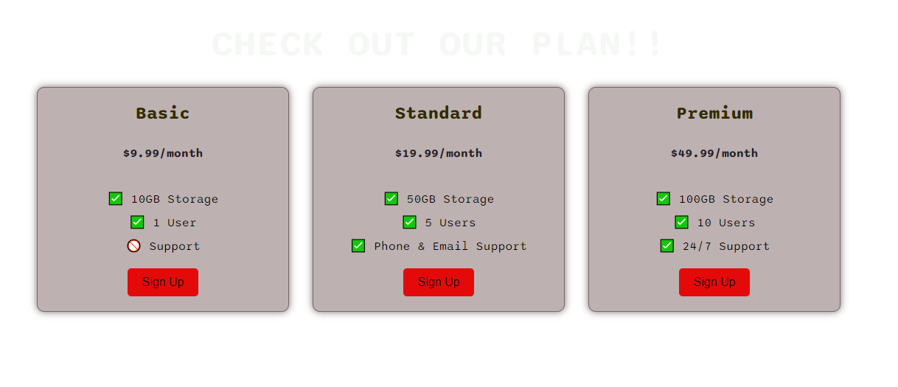

# Flexbox Pricing Table Project

This project demonstrates the creation of a pricing table using CSS and HTML, with a focus on utilizing the Flexbox layout. The goal is to achieve a visually appealing and responsive design similar to the provided `goal-large.png` image.

## Features

- Responsive design that adapts to different screen sizes
- Clean and modern layout using Flexbox
- Distinct sections for available plans and packages
- Hover effects and visual cues to enhance user experience

## Technologies Used

- HTML5
- CSS3
- Flexbox

## Getting Started

To get a local copy of the project up and running, follow these steps:

1. Clone the repository:
   
   git clone https://github.com/LynneDC/FlexboxPricingTableProject.git
   

2. Navigate to the project directory:
   
   cd flexbox-pricing-table
   

3. Open the `index.html` file in your preferred web browser.

## Usage

Feel free to explore the project and modify the code to suit your needs. You can customize the pricing table by adjusting the HTML structure and CSS styles.

## Contributing

Contributions are welcome! If you find any issues or have suggestions for improvements, please open an issue or submit a pull request.

## License

This project is licensed under the [MIT License](LICENSE).

## Acknowledgments

- [Flexbox Guide](https://css-tricks.com/snippets/css/a-guide-to-flexbox/) - A comprehensive guide to Flexbox
- [Pricing Table Inspiration](https://dribbble.com/shots/3475199-Pricing-Table) - Design inspiration for the pricing table
