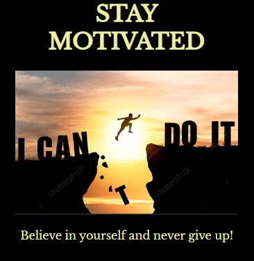

# Motivation Meme Project

This project is a website that allows users to create motivational memes. It is built using HTML and CSS.

## Steps Taken

1. **Set up the HTML structure**: Created the basic HTML structure with `<header>`, `<main>`, and `<footer>` sections.

2. **Added the meme creation section**: Implemented a section where users can input text for the top and bottom captions of the meme. This section includes input fields and a button to generate the meme.

3. **Implemented the meme display area**: Created a section where the generated meme will be displayed. This area includes an image container and placeholders for the top and bottom captions.

4. **Styled with CSS**: Applied CSS styles to the HTML elements to achieve the desired layout and visual appearance. This includes styling the header, main content area, footer, input fields, buttons, and the meme display section.

5. **Added interactivity with JavaScript**: Wrote JavaScript code to handle user input, generate the meme with the provided captions, and display the meme in the designated area.

6. **Tested and refined**: Thoroughly tested the website across different browsers and devices, making necessary adjustments and refinements to ensure a smooth user experience.

7. **Deployed the website**: Once the development and testing phases were complete, the website was deployed and made available for users to access and create their own motivational memes.

Feel free to explore the website, create your own memes, and share them with friends and family!
