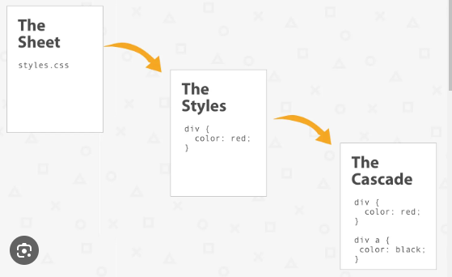
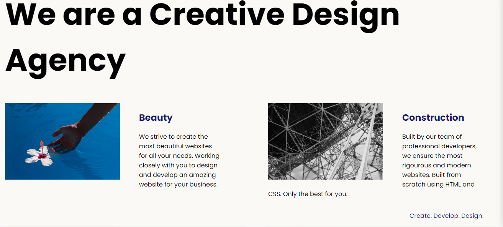

# CSS (Cascading Style Sheets)

## What is CSS?
CSS is a style sheet language used to describe the presentation of a document written in HTML or XML. It allows developers to control the layout, colors, fonts, and other visual aspects of web pages.

## CSS Syntax
CSS rules consist of selectors and declarations. Selectors specify which elements the rules apply to, and declarations define the styles for those elements.

## CSS Modules
- Backgrounds and Borders
- Text Effects
- 2D/3D Transformations
- Animations
- Multiple Column Layouts
- User Interface

## CSS Libraries and Frameworks
- Bootstrap
- Foundation
- Bulma
- Materialize
- Semantic UI
- Tailwind CSS

## Advanced CSS
- CSS Preprocessors (Sass, Less, Stylus)
- CSS Frameworks (Bootstrap, Foundation, Bulma)
- CSS Methodologies (BEM, OOCSS, SMACSS)
- CSS Architecture (ITCSS, ACSS)

## Projects with CSS and HTML
<ol>
    <li> <a href="./ColorVocabProject/">COLOR VOCAB</a> </li> 
     
    
In this project we covered <ul> <li>how to change text color using id selector</li>
        <li>How to change text sizes using class selector</li>
        <li>How to change Image size using tag selector</li> 
        </ul>
          
    

    <li> <a href="./CSSFlagProject/"> THE FLAG </a> </li> 
          
        
In this project we covered <ul> <li>how to change background color using combining selector</li>
        <li>How to create a shapeusing bolder radius </li>
        <li>How to color take precidends using specificiy</li>
        <li>How to change how to change and fix text positing </li>
    </ul>
     
    <li><a  href="./MotivationMemeProject/">MOTIVATION MEME</a></li>
     
    <ul>
          
        
In this project we covered <ul> <li>how to change the position of an element using absolute positioning</li>
        <li>How to change the position of an element using relative positioning</li> 
    </ul>
    <li><a href="./WebDesignAgencyProject/">Web Design Agency</a></li>
     
      
    
In this project we covered 
        <ul>
            <li>how to change the position of an element using absolute positioning</li>
            <li>How to change the position of an element using relative positioning</li>
            <li>How to change the position of an element using fixed positioning</li>
            <li>How to change the position of an element using sticky positioning</li>
            <li>How to change the position of an element using flexbox</li>
            <li>How to change the position of an element using grid</li>
        </ul>
    

</o>