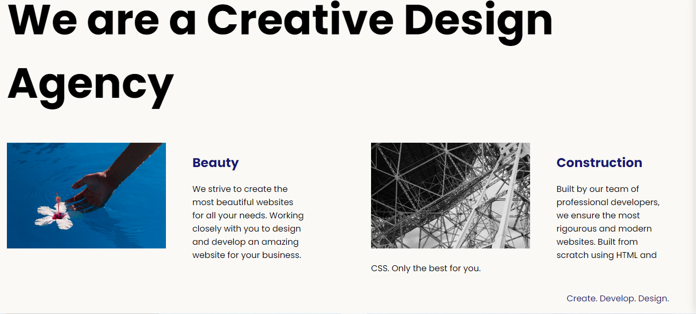

# Web Design Agency Project

 
 

This project is a website for a web design agency, developed using HTML and CSS. The website showcases the agency's services, portfolio, and provides information about the team and contact details.

## Project Overview

The main goal of this project was to create a visually appealing and user-friendly website that effectively communicates the agency's brand and services. The website features the following sections:

- **Home**: An introduction to the agency and its services, along with a call-to-action to get in touch.
- **About**: Information about the agency's history, mission, and team members.
- **Services**: A detailed description of the services offered by the agency, such as web design, development, and digital marketing.
- **Portfolio**: A showcase of the agency's previous work, including case studies and client testimonials.
- **Contact**: A contact form and other relevant information for potential clients to get in touch with the agency.

## Lessons Learned

During the development of this website, several valuable lessons were learned:

1. **Responsive Design**: Ensuring that the website is responsive and looks great on various devices (desktop, tablet, and mobile) was a crucial aspect. This involved using CSS media queries and flexible layouts.

2. **Accessibility**: Implementing accessibility best practices, such as proper use of semantic HTML elements, alt text for images, and keyboard navigation, was essential to make the website usable for all users.

3. **Performance Optimization**: Optimizing the website's performance by minifying CSS and HTML files, compressing images, and leveraging browser caching techniques was crucial for providing a smooth user experience.

4. **Cross-browser Compatibility**: Testing the website across different browsers and ensuring consistent behavior and appearance was a valuable lesson in web development.

5. **Version Control**: Using a version control system like Git made it easier to collaborate, track changes, and manage the project's codebase effectively.

6. **Design Systems**: Establishing a consistent design system with reusable components and styles helped maintain a cohesive look and feel throughout the website.

7. **User Experience (UX)**: Considering the user's needs and creating an intuitive navigation structure and content hierarchy was essential for delivering a positive user experience.

Overall, this project provided valuable hands-on experience in building a modern, responsive, and accessible website using HTML and CSS. The lessons learned will be invaluable for future web development projects.
